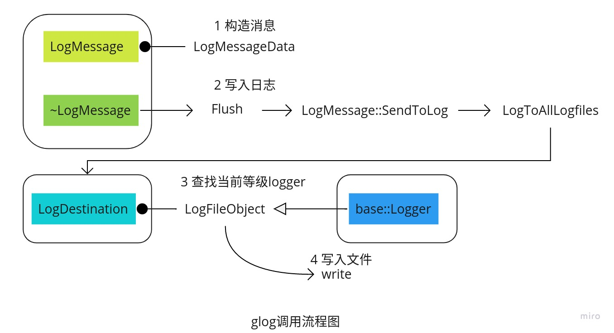

# dig-into-glog
glog是google出品的c++日志库，提供了很多非常不错的功能，例如日志分等级打印、条件打印、日志格式化、日志文件滚动大小等。下面我们主要分析下glog的代码，希望能对glog有一个全面的了解。  

下图是glog调用的主流程图。  
  

## 引用
glog的头文件在"src\glog"中，通过引用glog的头文件，就可以使用了glog相关的功能了。头文件的目录结构如下：  
```
.
├── log_severity.h
├── logging.h.in
├── raw_logging.h.in
├── stl_logging.h.in
└── vlog_is_on.h.in
```
其中`log_severity.h`和`vlog_is_on.h.in`已经在`logging.h.in`中引用，因此主要的头文件有3个
1. logging.h.in
2. raw_logging.h.in
3. stl_logging.h.in

使用glog主要的方式是通过"LOG(<a particular severity level>)"来使用，先看下面的一个例子。
```
LOG(INFO) << "Found " << num_cookies << " cookies";

LOG(ERROR) << "Found " << num_cookies << " cookies";
```

上面打印了2条日志信息，第一条是INFO等级，第二条是ERROR等级，实际上LOG()是一个宏
```
#define LOG(severity) COMPACT_GOOGLE_LOG_ ## severity.stream()
```
上面的"##"是一个连接符，当severity为INFO的时候，真正的宏定义为
```
COMPACT_GOOGLE_LOG_INFO.stream()
```
在代码中`COMPACT_GOOGLE_LOG_INFO`又是一个宏定义
```
#define COMPACT_GOOGLE_LOG_INFO @ac_google_namespace@::LogMessage( \
      __FILE__, __LINE__)
```
也就是说LOG(INFO)最终会调用到`LogMessage`并且获取输出流stream()，之后的输出和std::cout输出的格式一样，通过操作符重载，进行输出。

了解了上述原理，我们也可以自己定义宏来打印，例如：
```
#define AINFO                         \
  google::LogMessage(__FILE__, __LINE__, google::INFO).stream()
```
这样我们就可以用
```
AINFO << "hello world";
```
来打印INFO级别的日志信息了。

## 日志打印流程
实际上glog主要由"LogMessage","LogDestination"和"Logger"3个主要的对象来实现。主要的代码在"logging.cc"中，下面我们分别分析下上述类的实现过程。

#### LogMessage
每次打印日志的时候都会创建一个"LogMessage"对象，一条日志就对应一个"LogMessage"对象，LogMessage更像是一个容器，先获取消息，然后把消息交给Logger处理，Logger中可以对日志的输出做任何操作，包括输出到控制台，保存到文件，甚至通过网络发送。

LogMessage的构造函数非常多，也可以自己指定保存函数，而不是使用Logger中的函数，下面我们看下其中的一个构造函数。
```
LogMessage::LogMessage(const char* file, int line, LogSeverity severity)
    : allocated_(NULL) {
  Init(file, line, severity, &LogMessage::SendToLog);
}
```
可以看到在只指定文件名称，代码行和日志等级的情况下，LogMessage会为我们指定默认的日志发送函数`LogMessage::SendToLog`。日志的发送是在LogMessage的析构函数中实现的，每次LogMessage的析构函数中会调用"Flush()"，而"Flush()"会调用send_method_，也就是说LogMessage::Init中绑定的send_method在LogMessage析构的时候会进行调用，下面我们看下Init的实现。
```c++
void LogMessage::Init(const char* file,
                      int line,
                      LogSeverity severity,
                      void (LogMessage::*send_method)()) {
  allocated_ = NULL;
  // 1. 创建LogMessageData对象
  if (severity != GLOG_FATAL || !exit_on_dfatal) {
#ifdef GLOG_THREAD_LOCAL_STORAGE
    // No need for locking, because this is thread local.
    if (thread_data_available) {
      thread_data_available = false;
#ifdef HAVE_ALIGNED_STORAGE
      data_ = new (&thread_msg_data) LogMessageData;
#else
      const uintptr_t kAlign = sizeof(void*) - 1;

      char* align_ptr =
          reinterpret_cast<char*>(reinterpret_cast<uintptr_t>(thread_msg_data + kAlign) & ~kAlign);
      data_ = new (align_ptr) LogMessageData;
      assert(reinterpret_cast<uintptr_t>(align_ptr) % sizeof(void*) == 0);
#endif
    } else {
      allocated_ = new LogMessageData();
      data_ = allocated_;
    }
#else // !defined(GLOG_THREAD_LOCAL_STORAGE)
    allocated_ = new LogMessageData();
    data_ = allocated_;
#endif // defined(GLOG_THREAD_LOCAL_STORAGE)
    data_->first_fatal_ = false;
  } else {
  	// 2. 错误处理
    MutexLock l(&fatal_msg_lock);
    if (fatal_msg_exclusive) {
      fatal_msg_exclusive = false;
      data_ = &fatal_msg_data_exclusive;
      data_->first_fatal_ = true;
    } else {
      data_ = &fatal_msg_data_shared;
      data_->first_fatal_ = false;
    }
  }
  
  // 3. 对data进行赋值
  stream().fill('0');
  data_->preserved_errno_ = errno;
  data_->severity_ = severity;
  data_->line_ = line;
  data_->send_method_ = send_method;   // 4. LogMessage::SendToLog赋值给send_method_
  data_->sink_ = NULL;
  data_->outvec_ = NULL;
  WallTime now = WallTime_Now();
  data_->timestamp_ = static_cast<time_t>(now);
  localtime_r(&data_->timestamp_, &data_->tm_time_);
  data_->usecs_ = static_cast<int32>((now - data_->timestamp_) * 1000000);

  data_->num_chars_to_log_ = 0;
  data_->num_chars_to_syslog_ = 0;
  data_->basename_ = const_basename(file);
  data_->fullname_ = file;
  data_->has_been_flushed_ = false;
  
  // 5. 日志每行都输出一个前缀
  // If specified, prepend a prefix to each line.  For example:
  //    I20201018 160715 f5d4fbb0 logging.cc:1153]
  //    (log level, GMT year, month, date, time, thread_id, file basename, line)
  // We exclude the thread_id for the default thread.
  if (FLAGS_log_prefix && (line != kNoLogPrefix)) {
    stream() << LogSeverityNames[severity][0]
             << setw(4) << 1900+data_->tm_time_.tm_year
             << setw(2) << 1+data_->tm_time_.tm_mon
             << setw(2) << data_->tm_time_.tm_mday
             << ' '
             << setw(2) << data_->tm_time_.tm_hour  << ':'
             << setw(2) << data_->tm_time_.tm_min   << ':'
             << setw(2) << data_->tm_time_.tm_sec   << "."
             << setw(6) << data_->usecs_
             << ' '
             << setfill(' ') << setw(5)
             << static_cast<unsigned int>(GetTID()) << setfill('0')
             << ' '
             << data_->basename_ << ':' << data_->line_ << "] ";
  }
  data_->num_prefix_chars_ = data_->stream_.pcount();
  
  // 6. 用于trace
  if (!FLAGS_log_backtrace_at.empty()) {
    char fileline[128];
    snprintf(fileline, sizeof(fileline), "%s:%d", data_->basename_, line);
#ifdef HAVE_STACKTRACE
    if (!strcmp(FLAGS_log_backtrace_at.c_str(), fileline)) {
      string stacktrace;
      DumpStackTraceToString(&stacktrace);
      stream() << " (stacktrace:\n" << stacktrace << ") ";
    }
#endif
  }
}
```
LogMessage构造函数的目的就是传入send_method，并且构造日志的前缀，并且创建osstream对象。接下来我们看它的析构函数。

```c++
LogMessage::~LogMessage() {
  // 1. 刷新缓冲
  Flush();
#ifdef GLOG_THREAD_LOCAL_STORAGE
  if (data_ == static_cast<void*>(&thread_msg_data)) {
    data_->~LogMessageData();
    thread_data_available = true;
  }
  else {
    delete allocated_;
  }
#else // !defined(GLOG_THREAD_LOCAL_STORAGE)
  delete allocated_;
#endif // defined(GLOG_THREAD_LOCAL_STORAGE)
}
```

Flush的具体实现如下：
```c++
void LogMessage::Flush() {
  // 1. 如果日志等级小于FLAGS_minloglevel，则不打印
  if (data_->has_been_flushed_ || data_->severity_ < FLAGS_minloglevel)
    return;

  data_->num_chars_to_log_ = data_->stream_.pcount();
  data_->num_chars_to_syslog_ =
    data_->num_chars_to_log_ - data_->num_prefix_chars_;

  // Do we need to add a \n to the end of this message?
  bool append_newline =
      (data_->message_text_[data_->num_chars_to_log_-1] != '\n');
  char original_final_char = '\0';

  // If we do need to add a \n, we'll do it by violating the memory of the
  // ostrstream buffer.  This is quick, and we'll make sure to undo our
  // modification before anything else is done with the ostrstream.  It
  // would be preferable not to do things this way, but it seems to be
  // the best way to deal with this.
  if (append_newline) {
    original_final_char = data_->message_text_[data_->num_chars_to_log_];
    data_->message_text_[data_->num_chars_to_log_++] = '\n';
  }

  // 2. 调用send_method_方法
  // Prevent any subtle race conditions by wrapping a mutex lock around
  // the actual logging action per se.
  {
    MutexLock l(&log_mutex);
    (this->*(data_->send_method_))();
    ++num_messages_[static_cast<int>(data_->severity_)];
  }
  LogDestination::WaitForSinks(data_);

  if (append_newline) {
    // Fix the ostrstream back how it was before we screwed with it.
    // It's 99.44% certain that we don't need to worry about doing this.
    data_->message_text_[data_->num_chars_to_log_-1] = original_final_char;
  }

  // If errno was already set before we enter the logging call, we'll
  // set it back to that value when we return from the logging call.
  // It happens often that we log an error message after a syscall
  // failure, which can potentially set the errno to some other
  // values.  We would like to preserve the original errno.
  if (data_->preserved_errno_ != 0) {
    errno = data_->preserved_errno_;
  }
  
  // 3. 设置has flush为真
  // Note that this message is now safely logged.  If we're asked to flush
  // again, as a result of destruction, say, we'll do nothing on future calls.
  data_->has_been_flushed_ = true;
}
```

那么我们再看下，上述已经绑定好的`LogMessage::SendToLog`的具体逻辑。
```c++
void LogMessage::SendToLog() EXCLUSIVE_LOCKS_REQUIRED(log_mutex) {
  static bool already_warned_before_initgoogle = false;

  log_mutex.AssertHeld();

  RAW_DCHECK(data_->num_chars_to_log_ > 0 &&
             data_->message_text_[data_->num_chars_to_log_-1] == '\n', "");

  // Messages of a given severity get logged to lower severity logs, too

  if (!already_warned_before_initgoogle && !IsGoogleLoggingInitialized()) {
    const char w[] = "WARNING: Logging before InitGoogleLogging() is "
                     "written to STDERR\n";
    WriteToStderr(w, strlen(w));
    already_warned_before_initgoogle = true;
  }

  // global flag: never log to file if set.  Also -- don't log to a
  // file if we haven't parsed the command line flags to get the
  // program name.
  if (FLAGS_logtostderr || !IsGoogleLoggingInitialized()) {
    ColoredWriteToStderr(data_->severity_,
                         data_->message_text_, data_->num_chars_to_log_);

    // this could be protected by a flag if necessary.
    LogDestination::LogToSinks(data_->severity_,
                               data_->fullname_, data_->basename_,
                               data_->line_, &data_->tm_time_,
                               data_->message_text_ + data_->num_prefix_chars_,
                               (data_->num_chars_to_log_ -
                                data_->num_prefix_chars_ - 1),
                               data_->usecs_);
  } else {

    // log this message to all log files of severity <= severity_
    LogDestination::LogToAllLogfiles(data_->severity_, data_->timestamp_,
                                     data_->message_text_,
                                     data_->num_chars_to_log_);

    LogDestination::MaybeLogToStderr(data_->severity_, data_->message_text_,
                                     data_->num_chars_to_log_);
    LogDestination::MaybeLogToEmail(data_->severity_, data_->message_text_,
                                    data_->num_chars_to_log_);
    LogDestination::LogToSinks(data_->severity_,
                               data_->fullname_, data_->basename_,
                               data_->line_, &data_->tm_time_,
                               data_->message_text_ + data_->num_prefix_chars_,
                               (data_->num_chars_to_log_
                                - data_->num_prefix_chars_ - 1),
                               data_->usecs_);
    // NOTE: -1 removes trailing \n
  }

  // If we log a FATAL message, flush all the log destinations, then toss
  // a signal for others to catch. We leave the logs in a state that
  // someone else can use them (as long as they flush afterwards)
  if (data_->severity_ == GLOG_FATAL && exit_on_dfatal) {
    if (data_->first_fatal_) {
      // Store crash information so that it is accessible from within signal
      // handlers that may be invoked later.
      RecordCrashReason(&crash_reason);
      SetCrashReason(&crash_reason);

      // Store shortened fatal message for other logs and GWQ status
      const int copy = min<int>(data_->num_chars_to_log_,
                                sizeof(fatal_message)-1);
      memcpy(fatal_message, data_->message_text_, copy);
      fatal_message[copy] = '\0';
      fatal_time = data_->timestamp_;
    }

    if (!FLAGS_logtostderr) {
      for (int i = 0; i < NUM_SEVERITIES; ++i) {
        if ( LogDestination::log_destinations_[i] )
          LogDestination::log_destinations_[i]->logger_->Write(true, 0, "", 0);
      }
    }

    // release the lock that our caller (directly or indirectly)
    // LogMessage::~LogMessage() grabbed so that signal handlers
    // can use the logging facility. Alternately, we could add
    // an entire unsafe logging interface to bypass locking
    // for signal handlers but this seems simpler.
    log_mutex.Unlock();
    LogDestination::WaitForSinks(data_);

    const char* message = "*** Check failure stack trace: ***\n";
    if (write(STDERR_FILENO, message, strlen(message)) < 0) {
      // Ignore errors.
    }
    Fail();
  }
}
```

其中主要的函数调用是`LogToAllLogfiles`，可以看到高级别的日志会打印到低级别的日志文件，而低级别不会打印到高等级。  
```c++
inline void LogDestination::LogToAllLogfiles(LogSeverity severity,
                                             time_t timestamp,
                                             const char* message,
                                             size_t len) {

  if ( FLAGS_logtostderr ) {           // global flag: never log to file
    ColoredWriteToStderr(severity, message, len);
  } else {
    for (int i = severity; i >= 0; --i)
      LogDestination::MaybeLogToLogfile(i, timestamp, message, len);
  }
}
```

MaybeLogToLogfile中会调用LogDestination的logger进行具体的消息处理。  
```c++
inline void LogDestination::MaybeLogToLogfile(LogSeverity severity,
                                              time_t timestamp,
					      const char* message,
					      size_t len) {
  const bool should_flush = severity > FLAGS_logbuflevel;
  LogDestination* destination = log_destination(severity);
  destination->logger_->Write(should_flush, timestamp, message, len);
}
```

## LogDestination
LogDestination相当于是一个容器，用于盛放logger，LogDestination类中的函数都是static类型，因此可以直接调用。
```c++
inline LogDestination* LogDestination::log_destination(LogSeverity severity) {
  assert(severity >=0 && severity < NUM_SEVERITIES);
  if (!log_destinations_[severity]) {
    log_destinations_[severity] = new LogDestination(severity, NULL);
  }
  return log_destinations_[severity];
}
```
这里要注意，当获取对应日志等级的LogDestination不存在的时候，则创建一个新的LogDestination。新的LogDestination的logger使用默认的fileobject（它继承至logger），也就是LogDestination默认的logger是LogFileObject。LogDestination的构造函数如下：
```c++
LogDestination::LogDestination(LogSeverity severity,
                               const char* base_filename)
  : fileobject_(severity, base_filename),
    logger_(&fileobject_) {
}
```
LogDestination的构造函数先构造一个fileobject_，然后把fileobject_赋值给logger_。


## Logger

LogFileObject继承至Logger
```c++
class LogFileObject : public base::Logger {
 public:
  LogFileObject(LogSeverity severity, const char* base_filename);
```

可以看到Logger是一个纯虚函数，也就是说，是一个接口类。


如果想自己创建logger，可以用"SetLogger"来设置对应等级的自己的logger。
```c++
void base::SetLogger(LogSeverity severity, base::Logger* logger) {
  MutexLock l(&log_mutex);
  LogDestination::log_destination(severity)->logger_ = logger;
}
```

而上述我们已经分析过LogDestination会调用Logger类的Write接口。LogFileObject::Write中会判断有没有文件，如果没有文件则创建文件，如果文件名为空则创建"UNKNOWN"的文件，有文件则把消息写入文件。
```c++
void LogFileObject::Write(bool force_flush,
                          time_t timestamp,
                          const char* message,
                          int message_len) {
  MutexLock l(&lock_);

  // We don't log if the base_name_ is "" (which means "don't write")
  if (base_filename_selected_ && base_filename_.empty()) {
    return;
  }

  if (static_cast<int>(file_length_ >> 20) >= MaxLogSize() ||
      PidHasChanged()) {
    if (file_ != NULL) fclose(file_);
    file_ = NULL;
    file_length_ = bytes_since_flush_ = dropped_mem_length_ = 0;
    rollover_attempt_ = kRolloverAttemptFrequency-1;
  }

  // If there's no destination file, make one before outputting
  if (file_ == NULL) {
    // Try to rollover the log file every 32 log messages.  The only time
    // this could matter would be when we have trouble creating the log
    // file.  If that happens, we'll lose lots of log messages, of course!
    if (++rollover_attempt_ != kRolloverAttemptFrequency) return;
    rollover_attempt_ = 0;

    struct ::tm tm_time;
    localtime_r(&timestamp, &tm_time);

    // The logfile's filename will have the date/time & pid in it
    ostringstream time_pid_stream;
    time_pid_stream.fill('0');
    time_pid_stream << 1900+tm_time.tm_year
                    << setw(2) << 1+tm_time.tm_mon
                    << setw(2) << tm_time.tm_mday
                    << '-'
                    << setw(2) << tm_time.tm_hour
                    << setw(2) << tm_time.tm_min
                    << setw(2) << tm_time.tm_sec
                    << '.'
                    << GetMainThreadPid();
    const string& time_pid_string = time_pid_stream.str();

    if (base_filename_selected_) {
      if (!CreateLogfile(time_pid_string)) {
        perror("Could not create log file");
        fprintf(stderr, "COULD NOT CREATE LOGFILE '%s'!\n",
                time_pid_string.c_str());
        return;
      }
    } else {
      // If no base filename for logs of this severity has been set, use a
      // default base filename of
      // "<program name>.<hostname>.<user name>.log.<severity level>.".  So
      // logfiles will have names like
      // webserver.examplehost.root.log.INFO.19990817-150000.4354, where
      // 19990817 is a date (1999 August 17), 150000 is a time (15:00:00),
      // and 4354 is the pid of the logging process.  The date & time reflect
      // when the file was created for output.
      //
      // Where does the file get put?  Successively try the directories
      // "/tmp", and "."
      string stripped_filename(
          glog_internal_namespace_::ProgramInvocationShortName());
      string hostname;
      GetHostName(&hostname);

      string uidname = MyUserName();
      // We should not call CHECK() here because this function can be
      // called after holding on to log_mutex. We don't want to
      // attempt to hold on to the same mutex, and get into a
      // deadlock. Simply use a name like invalid-user.
      if (uidname.empty()) uidname = "invalid-user";

      stripped_filename = stripped_filename+'.'+hostname+'.'
                          +uidname+".log."
                          +LogSeverityNames[severity_]+'.';
      // We're going to (potentially) try to put logs in several different dirs
      const vector<string> & log_dirs = GetLoggingDirectories();

      // Go through the list of dirs, and try to create the log file in each
      // until we succeed or run out of options
      bool success = false;
      for (vector<string>::const_iterator dir = log_dirs.begin();
           dir != log_dirs.end();
           ++dir) {
        base_filename_ = *dir + "/" + stripped_filename;
        if ( CreateLogfile(time_pid_string) ) {
          success = true;
          break;
        }
      }
      // If we never succeeded, we have to give up
      if ( success == false ) {
        perror("Could not create logging file");
        fprintf(stderr, "COULD NOT CREATE A LOGGINGFILE %s!",
                time_pid_string.c_str());
        return;
      }
    }

    // Write a header message into the log file
    ostringstream file_header_stream;
    file_header_stream.fill('0');
    file_header_stream << "Log file created at: "
                       << 1900+tm_time.tm_year << '/'
                       << setw(2) << 1+tm_time.tm_mon << '/'
                       << setw(2) << tm_time.tm_mday
                       << ' '
                       << setw(2) << tm_time.tm_hour << ':'
                       << setw(2) << tm_time.tm_min << ':'
                       << setw(2) << tm_time.tm_sec << '\n'
                       << "Running on machine: "
                       << LogDestination::hostname() << '\n'
                       << "Log line format: [IWEF]yyyymmdd hh:mm:ss.uuuuuu "
                       << "threadid file:line] msg" << '\n';
    const string& file_header_string = file_header_stream.str();

    const int header_len = file_header_string.size();
    fwrite(file_header_string.data(), 1, header_len, file_);
    file_length_ += header_len;
    bytes_since_flush_ += header_len;
  }
 
  // Write to LOG file
  if ( !stop_writing ) {
    // fwrite() doesn't return an error when the disk is full, for
    // messages that are less than 4096 bytes. When the disk is full,
    // it returns the message length for messages that are less than
    // 4096 bytes. fwrite() returns 4096 for message lengths that are
    // greater than 4096, thereby indicating an error.
    errno = 0;
    fwrite(message, 1, message_len, file_);
    if ( FLAGS_stop_logging_if_full_disk &&
         errno == ENOSPC ) {  // disk full, stop writing to disk
      stop_writing = true;  // until the disk is
      return;
    } else {
      file_length_ += message_len;
      bytes_since_flush_ += message_len;
    }
  } else {
    if ( CycleClock_Now() >= next_flush_time_ )
      stop_writing = false;  // check to see if disk has free space.
    return;  // no need to flush
  }

  // See important msgs *now*.  Also, flush logs at least every 10^6 chars,
  // or every "FLAGS_logbufsecs" seconds.
  if ( force_flush ||
       (bytes_since_flush_ >= 1000000) ||
       (CycleClock_Now() >= next_flush_time_) ) {
    FlushUnlocked();
#ifdef OS_LINUX
    // Only consider files >= 3MiB
    if (FLAGS_drop_log_memory && file_length_ >= (3 << 20)) {
      // Don't evict the most recent 1-2MiB so as not to impact a tailer
      // of the log file and to avoid page rounding issue on linux < 4.7
      uint32 total_drop_length = (file_length_ & ~((1 << 20) - 1)) - (1 << 20);
      uint32 this_drop_length = total_drop_length - dropped_mem_length_;
      if (this_drop_length >= (2 << 20)) {
        // Only advise when >= 2MiB to drop
# if defined(__ANDROID__) && defined(__ANDROID_API__) && (__ANDROID_API__ < 21)
        // 'posix_fadvise' introduced in API 21:
        // * https://android.googlesource.com/platform/bionic/+/6880f936173081297be0dc12f687d341b86a4cfa/libc/libc.map.txt#732
# else
        posix_fadvise(fileno(file_), dropped_mem_length_, this_drop_length,
                      POSIX_FADV_DONTNEED);
# endif
        dropped_mem_length_ = total_drop_length;
      }
    }
#endif
    // Perform clean up for old logs
    if (log_cleaner_enabled_) {
      const vector<string>& dirs = GetLoggingDirectories();
      for (size_t i = 0; i < dirs.size(); i++) {
        vector<string> logs = GetOverdueLogNames(dirs[i], log_cleaner_overdue_days_);
        for (size_t j = 0; j < logs.size(); j++) {
          static_cast<void>(unlink(logs[j].c_str()));
        }
      }
    }
  }
}
```

## 改进
网上有一些讨论glog改进的文章，比如获取时间的函数太占用系统资源，比如同时写文件获取锁也会占用大量的系统时间，后面我们会对这些问题进行进一步的分析，并且分析其它优秀的日志库，包括不仅限于c++，一起看下日志库有哪些优秀特性？


